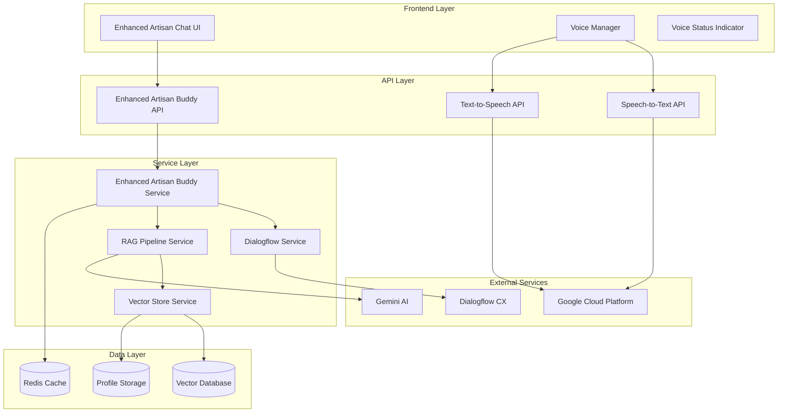

# Enhanced Artisan Buddy Design Document

## Overview

The Enhanced Artisan Buddy is a sophisticated conversational AI system that combines multiple technologies to provide personalized assistance to artisans. The system integrates speech processing, natural language understanding, vector-based knowledge retrieval, and conversational AI to create a comprehensive artisan support platform.

## Architecture

### High-Level Architecture



### Component Architecture

The system follows a layered architecture with clear separation of concerns:

1. **Presentation Layer**: React components for user interaction
2. **API Layer**: Next.js API routes for request handling
3. **Service Layer**: Business logic and integration services
4. **Data Layer**: Vector database and caching systems
5. **External Integration Layer**: Third-party AI and cloud services

## Components and Interfaces

### 1. Enhanced Artisan Chat UI Component

**Purpose**: Primary user interface for conversational interaction

**Key Features**:
- Real-time message display with typing indicators
- Voice recording controls with visual feedback
- Profile context display
- Conversation history management
- Responsive design for mobile and desktop

**Interface**:
```typescript
interface EnhancedArtisanChatProps {
  userId: string;
  initialContext?: ArtisanProfile;
  onProfileUpdate?: (profile: ArtisanProfile) => void;
}

interface ChatMessage {
  id: string;
  content: string;
  sender: 'user' | 'assistant';
  timestamp: Date;
  audioUrl?: string;
  metadata?: MessageMetadata;
}
```

### 2. Enhanced Artisan Buddy Service

**Purpose**: Core orchestration service that coordinates all AI interactions

**Key Responsibilities**:
- Message processing and routing
- Context management across conversations
- Integration with Dialogflow for intent recognition
- RAG pipeline coordination
- Response generation and formatting

**Interface**:
```typescript
interface EnhancedArtisanBuddyService {
  processMessage(input: MessageInput): Promise<MessageResponse>;
  initializeConversation(userId: string): Promise<ConversationContext>;
  updateProfile(userId: string, profile: ArtisanProfile): Promise<void>;
  getConversationHistory(userId: string): Promise<ChatMessage[]>;
}

interface MessageInput {
  content: string;
  userId: string;
  conversationId: string;
  inputType: 'text' | 'voice';
  context?: ConversationContext;
}
```

### 3. RAG Pipeline Service

**Purpose**: Retrieval-Augmented Generation system for personalized responses

**Key Components**:
- **Query Processor**: Analyzes user queries for relevant information needs
- **Vector Retriever**: Searches vector store for relevant artisan profiles and knowledge
- **Context Combiner**: Merges retrieved information with conversation context
- **Response Generator**: Creates personalized responses using retrieved context

**Interface**:
```typescript
interface RAGPipelineService {
  retrieveRelevantContext(query: string, userId: string): Promise<RetrievalResult[]>;
  generateResponse(query: string, context: RetrievalResult[]): Promise<string>;
  updateKnowledgeBase(profile: ArtisanProfile): Promise<void>;
}

interface RetrievalResult {
  content: string;
  source: string;
  relevanceScore: number;
  metadata: ProfileMetadata;
}
```

### 4. Vector Store Service

**Purpose**: Manages artisan profile storage and semantic search capabilities

**Key Features**:
- Profile embedding generation using sentence transformers
- Semantic similarity search
- Profile clustering and recommendation
- Real-time profile updates

**Interface**:
```typescript
interface VectorStoreService {
  storeProfile(profile: ArtisanProfile): Promise<string>;
  searchSimilarProfiles(query: string, limit: number): Promise<ProfileMatch[]>;
  updateProfile(profileId: string, updates: Partial<ArtisanProfile>): Promise<void>;
  deleteProfile(profileId: string): Promise<void>;
}

interface ProfileMatch {
  profile: ArtisanProfile;
  similarity: number;
  matchedFields: string[];
}
```

### 5. Voice Integration Services

**Speech-to-Text Service**:
- Google Cloud Speech-to-Text integration
- Real-time streaming recognition
- Language detection and adaptation
- Noise filtering and enhancement

**Text-to-Speech Service**:
- Google Cloud Text-to-Speech integration
- Voice selection based on user preferences
- SSML support for natural speech patterns
- Audio caching for common responses

## Data Models

### Artisan Profile Model

```typescript
interface ArtisanProfile {
  id: string;
  userId: string;
  personalInfo: {
    name: string;
    location: string;
    languages: string[];
    experience: number; // years
  };
  skills: {
    primary: string[];
    secondary: string[];
    certifications: string[];
  };
  products: {
    categories: string[];
    specialties: string[];
    priceRange: PriceRange;
  };
  preferences: {
    communicationStyle: 'formal' | 'casual' | 'technical';
    responseLength: 'brief' | 'detailed' | 'comprehensive';
    topics: string[];
  };
  businessInfo: {
    businessType: string;
    targetMarket: string[];
    challenges: string[];
    goals: string[];
  };
  metadata: {
    createdAt: Date;
    updatedAt: Date;
    completeness: number; // 0-100%
    embedding?: number[];
  };
}
```

### Conversation Context Model

```typescript
interface ConversationContext {
  conversationId: string;
  userId: string;
  currentIntent?: string;
  entities: Record<string, any>;
  profileContext?: ArtisanProfile;
  conversationHistory: ChatMessage[];
  sessionMetadata: {
    startTime: Date;
    lastActivity: Date;
    messageCount: number;
    voiceEnabled: boolean;
  };
}
```

## Error Handling

### Error Categories and Strategies

1. **Voice Processing Errors**:
   - Fallback to text input with clear user notification
   - Retry mechanisms for temporary network issues
   - Alternative voice providers as backup

2. **Vector Store Errors**:
   - Graceful degradation to general knowledge responses
   - Local caching of frequently accessed profiles
   - Background sync when service recovers

3. **Dialogflow Integration Errors**:
   - Fallback to basic NLP processing
   - Intent classification using local models
   - Manual intent selection interface

4. **AI Generation Errors**:
   - Pre-defined response templates for common scenarios
   - Error-specific helpful messages
   - Escalation to human support when appropriate

### Error Response Format

```typescript
interface ErrorResponse {
  error: {
    code: string;
    message: string;
    details?: any;
    fallbackAction?: string;
  };
  fallbackResponse?: string;
  retryable: boolean;
}
```

## Testing Strategy

### Unit Testing

- **Service Layer Testing**: Mock external dependencies and test business logic
- **Component Testing**: Test React components with various props and states
- **Utility Function Testing**: Test helper functions and data transformations

### Integration Testing

- **API Endpoint Testing**: Test complete request/response cycles
- **Voice Pipeline Testing**: Test SST/TTS integration with sample audio
- **Vector Store Testing**: Test profile storage and retrieval operations
- **Dialogflow Testing**: Test intent recognition with sample utterances

### End-to-End Testing

- **Conversation Flow Testing**: Test complete user journeys
- **Voice Interaction Testing**: Test voice-to-voice conversation cycles
- **Profile Management Testing**: Test profile creation, update, and retrieval
- **Error Scenario Testing**: Test system behavior under various failure conditions

### Performance Testing

- **Response Time Testing**: Ensure sub-2-second response times
- **Concurrent User Testing**: Test system under multiple simultaneous conversations
- **Vector Search Performance**: Test search response times with large profile datasets
- **Memory Usage Testing**: Monitor memory consumption during extended conversations

## Security Considerations

### Data Protection

- **Profile Data Encryption**: Encrypt sensitive artisan information at rest and in transit
- **Voice Data Handling**: Secure processing and optional deletion of voice recordings
- **Conversation Privacy**: Implement conversation data retention policies

### Access Control

- **User Authentication**: Verify user identity before accessing profiles
- **Profile Isolation**: Ensure users can only access their own profile data
- **API Rate Limiting**: Prevent abuse of voice and AI services

### Compliance

- **GDPR Compliance**: Implement data subject rights for profile management
- **Voice Data Consent**: Clear consent mechanisms for voice processing
- **Data Minimization**: Store only necessary information for functionality

## Performance Optimization

### Caching Strategy

- **Response Caching**: Cache common responses to reduce AI generation costs
- **Profile Caching**: Cache frequently accessed profiles in Redis
- **Vector Search Caching**: Cache search results for similar queries

### Optimization Techniques

- **Lazy Loading**: Load conversation history and profiles on demand
- **Connection Pooling**: Optimize database and external service connections
- **Batch Processing**: Group similar operations for efficiency
- **CDN Integration**: Serve static assets and cached audio from CDN

## Deployment Architecture

### Microservices Deployment

- **API Gateway**: Route requests to appropriate services
- **Service Mesh**: Handle inter-service communication and monitoring
- **Container Orchestration**: Use Kubernetes for scalable deployment
- **Database Clustering**: Implement vector database clustering for high availability

### Monitoring and Observability

- **Application Metrics**: Track response times, error rates, and user engagement
- **Infrastructure Monitoring**: Monitor resource usage and system health
- **Conversation Analytics**: Track conversation quality and user satisfaction
- **Voice Quality Metrics**: Monitor SST/TTS accuracy and performance