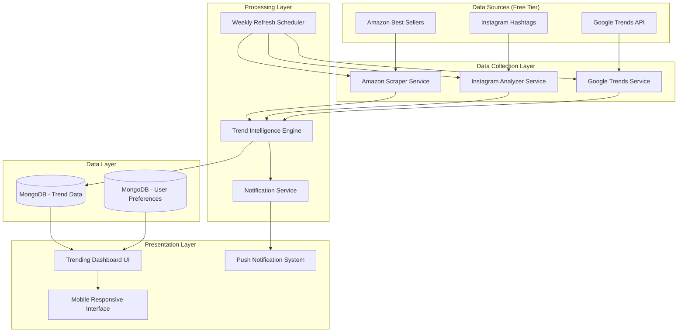

# Design Document

## Overview

The Trending Technology Stack is a comprehensive intelligence system that aggregates trend data from multiple free sources to provide artisans with actionable market insights. The system operates on a weekly refresh cycle, combining Amazon marketplace data, Instagram social trends, and Google search trends into a unified dashboard experience.

The architecture follows a microservices approach with dedicated scrapers for each data source, a central trend intelligence engine for analysis, and a responsive dashboard for user interaction. All components are designed to operate within free-tier limitations while providing enterprise-level insights.

## Architecture

### System Architecture Diagram



### Data Flow Architecture

1. **Collection Phase**: Scrapers run weekly to gather fresh data
2. **Processing Phase**: Intelligence engine analyzes and scores trends
3. **Storage Phase**: Processed data stored with historical context
4. **Presentation Phase**: Dashboard displays filtered, relevant trends
5. **Notification Phase**: Alerts sent for high-priority opportunities

## Components and Interfaces

### 1. Amazon Scraper Service

**Purpose**: Extract trending product data from Amazon marketplace

**Key Methods**:
```typescript
interface AmazonScraperService {
  scrapeBestSellers(category: string): Promise<ProductTrend[]>
  scrapeMoversAndShakers(): Promise<ProductTrend[]>
  extractProductDetails(url: string): Promise<ProductDetails>
  trackRankChanges(products: ProductTrend[]): Promise<RankChange[]>
}
```

**Data Extraction Points**:
- Best Sellers by category (Crafts, Home & Kitchen, etc.)
- Movers & Shakers (rapidly trending items)
- Product titles, prices, ratings, sales ranks
- Rank change indicators and velocity

**Free-Tier Implementation**:
- Web scraping using Puppeteer/Playwright
- Rate limiting to avoid detection (1 request per 3 seconds)
- User-agent rotation and proxy support
- Caching to minimize requests

### 2. Instagram Analyzer Service

**Purpose**: Monitor craft-related social media trends

**Key Methods**:
```typescript
interface InstagramAnalyzerService {
  analyzeHashtagTrends(hashtags: string[]): Promise<HashtagTrend[]>
  scrapePopularPosts(hashtag: string): Promise<PopularPost[]>
  trackEngagementRates(posts: PopularPost[]): Promise<EngagementMetrics[]>
  identifyViralTechniques(): Promise<ViralTechnique[]>
}
```

**Data Extraction Points**:
- Hashtag post counts (#pottery, #woodworking, #handmade)
- Engagement rates (likes, comments, shares)
- Viral craft techniques and styles
- Influencer mentions and trending creators

**Free-Tier Implementation**:
- Public Instagram data scraping
- Hashtag analysis without API access
- Image recognition for craft technique identification
- Engagement rate calculations

### 3. Trend Intelligence Engine

**Purpose**: Process and analyze multi-source trend data

**Key Methods**:
```typescript
interface TrendIntelligenceEngine {
  calculateTrendScore(sources: TrendData[]): Promise<number>
  identifyGrowthPatterns(historical: TrendHistory[]): Promise<GrowthPattern>
  detectSeasonalTrends(timeframe: DateRange): Promise<SeasonalTrend[]>
  generatePredictions(trends: ProcessedTrend[]): Promise<TrendPrediction[]>
}
```

**Analysis Algorithms**:
- **Trend Scoring**: Weighted combination of Amazon rank changes, Instagram engagement, Google search volume
- **Growth Detection**: Week-over-week percentage changes with velocity calculations
- **Seasonal Analysis**: Historical pattern recognition for festival/holiday trends
- **Prediction Engine**: Machine learning model for trend longevity prediction

### 4. Weekly Refresh Scheduler

**Purpose**: Automate data collection and processing

**Key Methods**:
```typescript
interface WeeklyRefreshScheduler {
  scheduleWeeklyRefresh(): Promise<void>
  executeDataCollection(): Promise<CollectionResult>
  processNewTrendData(): Promise<ProcessingResult>
  sendWeeklyNotifications(): Promise<NotificationResult>
}
```

**Scheduling Logic**:
- Runs every Sunday at 2:00 AM IST
- Sequential execution: Amazon → Instagram → Google Trends
- Error handling and retry mechanisms
- Progress tracking and logging

## Data Models

### Core Data Models

```typescript
// Primary trend data structure
interface ProcessedTrend {
  id: string
  title: string
  category: ProfessionCategory
  sources: TrendSource[]
  trendScore: number
  growthRate: number
  trendType: 'hot' | 'rising' | 'seasonal' | 'cooling'
  lastUpdated: Date
  historicalData: TrendSnapshot[]
}

// Amazon-specific product data
interface ProductTrend {
  productId: string
  title: string
  price: number
  rating: number
  salesRank: number
  rankChange: number
  category: string
  imageUrl: string
  amazonUrl: string
}

// Instagram social media data
interface HashtagTrend {
  hashtag: string
  postCount: number
  engagementRate: number
  growthRate: number
  relatedHashtags: string[]
  viralPosts: PopularPost[]
}

// User preference and notification settings
interface UserPreferences {
  userId: string
  profession: ProfessionCategory
  notificationEnabled: boolean
  notificationThreshold: number
  preferredCategories: string[]
  weeklyDigest: boolean
}
```

### Database Schema Design

**Collections**:
1. `trends` - Current and historical trend data
2. `user_preferences` - Artisan notification settings
3. `trend_snapshots` - Weekly data snapshots for historical analysis
4. `notification_queue` - Pending notifications to send

**Indexing Strategy**:
- Compound index on `category + trendScore + lastUpdated`
- Text index on `title` for search functionality
- TTL index on `trend_snapshots` for automatic cleanup

## Error Handling

### Scraping Error Management

**Amazon Scraper Errors**:
- Rate limiting detection and backoff strategy
- CAPTCHA handling with manual intervention alerts
- Page structure changes with fallback selectors
- Network timeouts with exponential retry

**Instagram Analyzer Errors**:
- Account blocking detection and IP rotation
- Content loading failures with alternative approaches
- API rate limiting with graceful degradation
- Image processing errors with fallback text analysis

**Data Processing Errors**:
- Invalid data format handling with sanitization
- Missing data points with interpolation strategies
- Calculation errors with default value fallbacks
- Database connection issues with retry mechanisms

### User Experience Error Handling

- Graceful degradation when data sources are unavailable
- Loading states with progress indicators
- Error messages with actionable next steps
- Offline capability with cached data display

## Testing Strategy

### Unit Testing Approach

**Scraper Services Testing**:
```typescript
describe('AmazonScraperService', () => {
  it('should extract product details from HTML', async () => {
    const mockHtml = loadMockAmazonPage()
    const result = await scraper.extractProductDetails(mockHtml)
    expect(result.title).toBeDefined()
    expect(result.price).toBeGreaterThan(0)
  })
})
```

**Intelligence Engine Testing**:
```typescript
describe('TrendIntelligenceEngine', () => {
  it('should calculate trend scores correctly', async () => {
    const mockData = createMockTrendData()
    const score = await engine.calculateTrendScore(mockData)
    expect(score).toBeBetween(0, 100)
  })
})
```

### Integration Testing Strategy

**End-to-End Workflow Testing**:
1. Mock data collection from all sources
2. Verify data processing and scoring
3. Test database storage and retrieval
4. Validate UI rendering and user interactions
5. Confirm notification delivery

**Performance Testing**:
- Load testing with 1000+ concurrent users
- Scraping performance under rate limits
- Database query optimization validation
- Memory usage monitoring during data processing

### Manual Testing Scenarios

**User Acceptance Testing**:
1. Artisan logs in and views profession-specific trends
2. Trend growth indicators display correctly
3. Historical data shows seasonal patterns
4. Notifications arrive for high-scoring trends
5. Mobile interface responds properly on various devices

**Data Quality Testing**:
1. Verify Amazon product data accuracy
2. Confirm Instagram hashtag relevance
3. Validate trend score calculations
4. Check historical data consistency
5. Test notification threshold accuracy