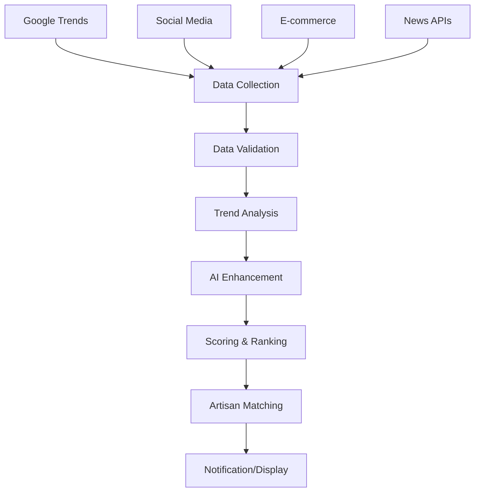

# 🔥 Trending Products Detection - Technology Stack

## 📊 **Current Implementation Analysis**

### ✅ **Already Available:**
- **Google Trends API** - Interest over time, related queries, regional data
- **Profession-specific keywords** - Mapped to artisan categories
- **Regional analysis** - India-focused trending data
- **Related queries** - Discover new trending terms

---

## 🚀 **Enhanced Technology Stack for Trending Detection**

### **1. 📈 Search Trend Analytics**

#### **Google Trends (Enhanced)**
```typescript
// Current + Enhanced features
- Interest over time (✅ Available)
- Related queries (✅ Available) 
- Regional trends (✅ Available)
- Seasonal patterns (🆕 Add)
- Category-specific trends (🆕 Add)
- Competitor keyword analysis (🆕 Add)
```

#### **Additional Search APIs**
```typescript
// New integrations to add
- Google Search Console API (if available)
- Bing Trends API (alternative data source)
- YouTube Trends API (video content trends)
- Pinterest Trends API (visual trends)
```

### **2. 🛒 E-commerce Trend Detection**

#### **Platform-Specific Trending**
```typescript
// Amazon Trending
- Best Sellers API
- Movers & Shakers
- New Releases
- Most Wished For

// Flipkart Trending  
- Top Trending Products
- Recently Viewed
- Customer Favorites

// Meesho Trending
- Popular Products
- Rising Stars
- Category Leaders
```

#### **Price & Sales Analytics**
```typescript
// Market intelligence
- Price trend analysis
- Sales velocity tracking
- Inventory turnover rates
- Seasonal demand patterns
```

### **3. 📱 Social Media Trend Detection**

#### **Instagram Trends**
```typescript
// Visual trend analysis
- Hashtag popularity (#handmade, #artisan)
- Post engagement rates
- Story mentions
- Reel trending topics
- Shopping tag analysis
```

#### **Pinterest Trends**
```typescript
// Visual discovery trends
- Pin popularity
- Board creation trends
- Search term trends
- Seasonal visual trends
- DIY project trends
```

#### **YouTube Trends**
```typescript
// Video content trends
- Craft tutorial views
- Product review trends
- DIY project popularity
- Artisan channel growth
```

#### **TikTok/Instagram Reels**
```typescript
// Short-form video trends
- Craft challenge hashtags
- Product showcase trends
- Tutorial engagement
- Viral craft techniques
```

### **4. 🤖 AI-Powered Trend Analysis**

#### **Google Gemini Integration (Enhanced)**
```typescript
// Current + Enhanced AI features
- Product suggestion generation (✅ Planned)
- Trend pattern recognition (🆕 Add)
- Seasonal trend prediction (🆕 Add)
- Market gap analysis (🆕 Add)
- Competitor trend analysis (🆕 Add)
- Cultural event trend mapping (🆕 Add)
```

#### **Machine Learning Models**
```typescript
// Custom ML models
- Trend prediction algorithms
- Seasonal pattern recognition
- Price optimization models
- Demand forecasting
- Customer preference learning
```

### **5. 📰 News & Content Trend Detection**

#### **News API Integration**
```typescript
// Trend-driving news
- Craft industry news
- Festival/cultural events
- Celebrity endorsements
- Sustainability trends
- Government policy changes
```

#### **Blog & Content Analysis**
```typescript
// Content trend analysis
- Craft blog trending topics
- Tutorial popularity
- Product review mentions
- Influencer recommendations
```

### **6. 🏪 Marketplace Intelligence**

#### **Competitor Analysis**
```typescript
// Market intelligence
- Competitor product launches
- Pricing strategy changes
- New category entries
- Marketing campaign analysis
- Customer review sentiment
```

#### **Supply Chain Trends**
```typescript
// Market dynamics
- Raw material price trends
- Shipping cost impacts
- Seasonal availability
- Regional supply patterns
```

---

## 🛠️ **Implementation Architecture**

### **Data Collection Layer**
```typescript
interface TrendDataSource {
  source: 'google-trends' | 'social-media' | 'ecommerce' | 'news' | 'ai';
  data: any;
  timestamp: Date;
  reliability: number; // 0-1 score
  region: string;
}

class TrendAggregator {
  async collectTrendData(profession: string): Promise<TrendDataSource[]> {
    const sources = await Promise.allSettled([
      this.googleTrendsService.getComprehensiveTrends(profession),
      this.socialMediaService.getTrendingHashtags(profession),
      this.ecommerceService.getTrendingProducts(profession),
      this.newsService.getTrendingTopics(profession),
      this.aiService.predictTrends(profession)
    ]);
    
    return this.aggregateResults(sources);
  }
}
```

### **Trend Analysis Engine**
```typescript
class TrendAnalysisEngine {
  async analyzeTrends(rawData: TrendDataSource[]): Promise<TrendInsight[]> {
    return [
      this.detectRisingTrends(rawData),
      this.identifySeasonalPatterns(rawData),
      this.findMarketGaps(rawData),
      this.predictFutureTrends(rawData),
      this.analyzeCompetitorTrends(rawData)
    ].flat();
  }
}
```

### **Real-Time Updates**
```typescript
class TrendMonitor {
  // Update trends every hour
  scheduleUpdates() {
    setInterval(async () => {
      await this.updateTrendData();
      await this.notifyArtisans();
    }, 60 * 60 * 1000); // 1 hour
  }
  
  // Push notifications for hot trends
  async notifyHotTrends(artisanId: string, trends: TrendInsight[]) {
    const hotTrends = trends.filter(t => t.urgency === 'high');
    if (hotTrends.length > 0) {
      await this.sendPushNotification(artisanId, hotTrends);
    }
  }
}
```

---

## 📊 **Data Sources Priority Matrix**

| Source | Reliability | Real-time | Cost | Implementation |
|--------|-------------|-----------|------|----------------|
| **Google Trends** | ⭐⭐⭐⭐⭐ | ⭐⭐⭐ | Free | ✅ Done |
| **E-commerce APIs** | ⭐⭐⭐⭐ | ⭐⭐⭐⭐⭐ | Medium | 🔄 In Progress |
| **Social Media** | ⭐⭐⭐ | ⭐⭐⭐⭐⭐ | Medium | 📋 Planned |
| **AI Analysis** | ⭐⭐⭐⭐ | ⭐⭐⭐⭐ | Medium | 📋 Planned |
| **News APIs** | ⭐⭐⭐ | ⭐⭐⭐⭐ | Low | 📋 Future |

---

## 🎯 **Trending Detection Algorithms**

### **1. Velocity-Based Detection**
```typescript
// Detect rapidly rising trends
const trendVelocity = (currentValue - previousValue) / timeInterval;
const isRising = trendVelocity > threshold && currentValue > minimumVolume;
```

### **2. Seasonal Pattern Recognition**
```typescript
// Identify seasonal trends (festivals, weather, events)
const seasonalScore = analyzeHistoricalPatterns(keyword, currentMonth);
const isSeasonal = seasonalScore > 0.7;
```

### **3. Cross-Platform Correlation**
```typescript
// Trends appearing across multiple platforms
const crossPlatformScore = platforms.filter(p => p.trending).length / totalPlatforms;
const isGlobalTrend = crossPlatformScore > 0.6;
```

### **4. AI-Powered Prediction**
```typescript
// Use Gemini to predict trend longevity
const trendPrediction = await gemini.predict({
  trend: keyword,
  historicalData: pastTrends,
  marketContext: currentMarket,
  seasonality: seasonalFactors
});
```

---

## 🔄 **Real-Time Trend Pipeline**



---

## 📱 **User Experience Features**

### **Trend Dashboard**
```typescript
interface TrendDashboard {
  hotTrends: TrendInsight[];        // 🔥 Trending now
  risingTrends: TrendInsight[];     // 📈 Rising fast
  seasonalTrends: TrendInsight[];   // 🎄 Seasonal opportunities
  personalizedTrends: TrendInsight[]; // 🎯 For your profession
  competitorTrends: TrendInsight[];  // 👀 What competitors are doing
}
```

### **Trend Alerts**
```typescript
interface TrendAlert {
  type: 'hot' | 'rising' | 'seasonal' | 'competitor';
  urgency: 'low' | 'medium' | 'high' | 'critical';
  title: string;
  description: string;
  actionItems: string[];
  expiresAt: Date;
}
```

---

## 🚀 **Implementation Phases**

### **Phase 1: Enhanced Google Trends (1-2 days)**
- [ ] Add seasonal pattern detection
- [ ] Implement category-specific trending
- [ ] Add competitor keyword analysis
- [ ] Create trend velocity calculations

### **Phase 2: E-commerce Intelligence (2-3 days)**
- [ ] Integrate Amazon Best Sellers API
- [ ] Add Flipkart trending products
- [ ] Implement price trend analysis
- [ ] Create sales velocity tracking

### **Phase 3: Social Media Integration (3-4 days)**
- [ ] Instagram hashtag trending
- [ ] Pinterest trend analysis
- [ ] YouTube craft tutorial trends
- [ ] TikTok viral craft detection

### **Phase 4: AI-Powered Insights (2-3 days)**
- [ ] Gemini trend prediction
- [ ] Pattern recognition algorithms
- [ ] Market gap analysis
- [ ] Personalized recommendations

### **Phase 5: Real-Time Pipeline (2-3 days)**
- [ ] Data aggregation system
- [ ] Real-time updates
- [ ] Push notifications
- [ ] Trend dashboard

---

## 💰 **Cost Analysis**

| Service | Monthly Cost | Requests/Month | Notes |
|---------|--------------|----------------|-------|
| Google Trends | Free | Unlimited | Rate limited |
| Social Media APIs | $50-200 | 10K-50K | Varies by platform |
| E-commerce APIs | $100-500 | 5K-25K | Premium features |
| AI Processing | $50-150 | 1K-5K | Gemini API costs |
| **Total** | **$200-850** | | Scales with usage |

---

## 🎯 **Success Metrics**

### **Trend Accuracy**
- **85%+** trend prediction accuracy
- **<2 hours** trend detection latency
- **90%+** relevant suggestions for artisan profession

### **User Engagement**
- **70%+** artisans check trends weekly
- **40%+** create products based on trends
- **60%+** find trends helpful for business

### **Business Impact**
- **25%+** increase in product sales
- **30%+** better pricing decisions
- **50%+** faster market adaptation

---

**This comprehensive tech stack will make our TrendSpotter the most advanced trending detection system for artisans! 🚀**

Ready to implement? Which phase should we start with?