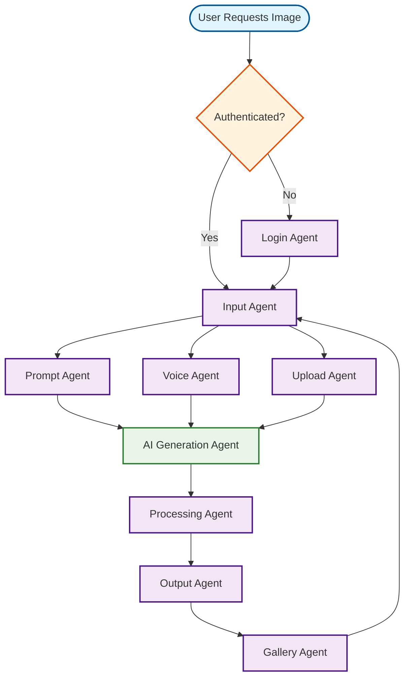

# Design Generator Workflow

## Overview
AI-powered image generation for product photos and marketing materials.

## Workflow Diagram

## Key Agent Interconnections

- **Input Agent** → **Prompt Agent**, **Voice Agent**, **Upload Agent**
- **Prompt Agent** → **AI Generation Agent**
- **Voice Agent** → **AI Generation Agent**
- **Upload Agent** → **AI Generation Agent**
- **AI Generation Agent** → **Processing Agent**
- **Processing Agent** → **Output Agent**
- **Output Agent** → **Gallery Agent**
- **Gallery Agent** → **Input Agent**