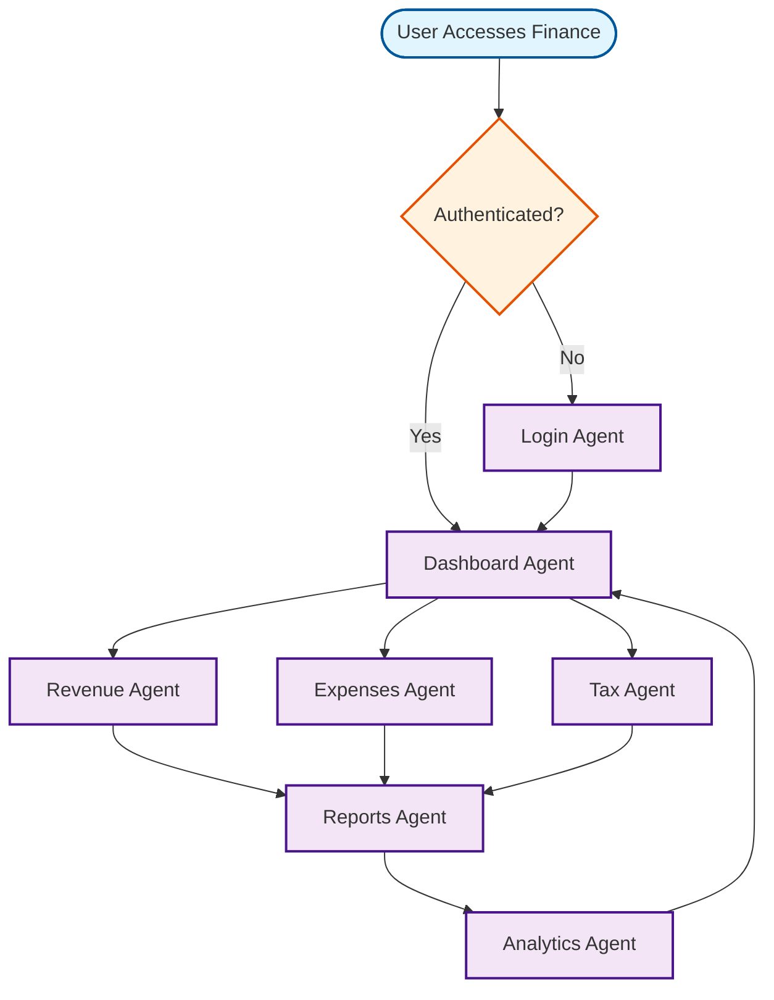

# Finance Services Workflow

## Overview
Comprehensive financial management tools for artisans and small businesses.

## Workflow Diagram

## Key Agent Interconnections

- **Dashboard Agent** ↔ **Revenue Agent**, **Expenses Agent**, **Tax Agent**
- **Revenue Agent** → **Reports Agent**
- **Expenses Agent** → **Reports Agent**
- **Tax Agent** → **Reports Agent**
- **Reports Agent** → **Analytics Agent**
- **Analytics Agent** → **Dashboard Agent**