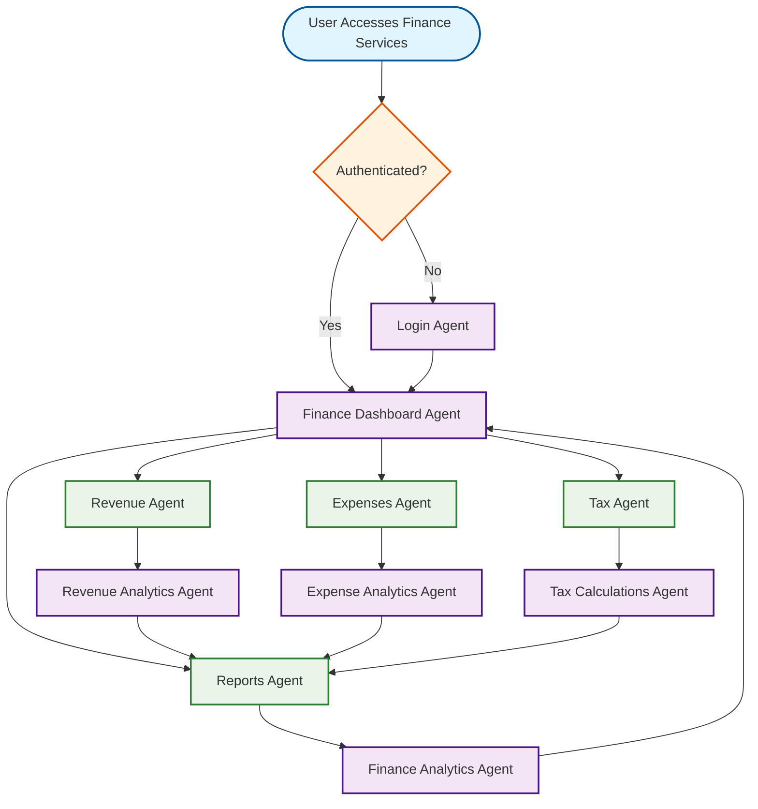

unning one# Finance Services Workflow

## Overview
Comprehensive financial management tools for artisans and small businesses - separate from the main dashboard.

## Workflow Diagram

## Key Agent Interconnections

- **Finance Dashboard Agent** → **Revenue Agent**, **Expenses Agent**, **Tax Agent**, **Reports Agent**
- **Revenue Agent** → **Revenue Analytics Agent**
- **Expenses Agent** → **Expense Analytics Agent**
- **Tax Agent** → **Tax Calculations Agent**
- **Revenue Analytics Agent** → **Reports Agent**
- **Expense Analytics Agent** → **Reports Agent**
- **Tax Calculations Agent** → **Reports Agent**
- **Reports Agent** → **Finance Analytics Agent**
- **Finance Analytics Agent** → **Finance Dashboard Agent**

## Finance Services Features

### Revenue Management
- **Sales Tracking**: Monitor product sales and revenue
- **Revenue Analytics**: Analyze revenue trends and patterns
- **Income Sources**: Track multiple revenue streams

### Expense Management
- **Expense Tracking**: Monitor business expenses
- **Expense Analytics**: Analyze spending patterns
- **Cost Categories**: Organize expenses by category

### Tax Management
- **Tax Calculations**: Automatic tax calculations
- **GST Management**: Goods and Services Tax handling
- **Tax Reports**: Generate tax-related reports

### Financial Reports
- **Income Statement**: Profit and loss statements
- **Balance Sheet**: Assets and liabilities
- **Cash Flow**: Cash flow analysis
- **Tax Reports**: Tax-related documentation