# Inventory Dashboard Workflow

## Overview
Dedicated dashboard for managing product inventory, stock levels, and product lifecycle management.

## Workflow Diagram

```mermaid
graph TD
    START([User Accesses Inventory]) --> AUTH_CHECK{Authenticated?}
    AUTH_CHECK -->|No| LOGIN[Login Agent]
    AUTH_CHECK -->|Yes| INVENTORY_DASHBOARD[Inventory Dashboard Agent]
    
    INVENTORY_DASHBOARD --> PRODUCTS[Products Agent]
    INVENTORY_DASHBOARD --> STOCK[Stock Management Agent]
    INVENTORY_DASHBOARD --> CATEGORIES[Categories Agent]
    INVENTORY_DASHBOARD --> ANALYTICS[Inventory Analytics Agent]
    
    PRODUCTS --> ADD_PRODUCT[Add Product Agent]
    PRODUCTS --> EDIT_PRODUCT[Edit Product Agent]
    PRODUCTS --> DELETE_PRODUCT[Delete Product Agent]
    PRODUCTS --> VIEW_PRODUCT[View Product Agent]
    
    STOCK --> STOCK_LEVELS[Stock Levels Agent]
    STOCK --> LOW_STOCK[Low Stock Agent]
    STOCK --> REORDER[Reorder Agent]
    STOCK --> ADJUSTMENTS[Stock Adjustments Agent]
    
    CATEGORIES --> MANAGE_CATEGORIES[Manage Categories Agent]
    CATEGORIES --> CATEGORY_ANALYTICS[Category Analytics Agent]
    
    ANALYTICS --> SALES_PERFORMANCE[Sales Performance Agent]
    ANALYTICS --> INVENTORY_TURNS[Inventory Turns Agent]
    ANALYTICS --> PROFITABILITY[Profitability Agent]
    
    ADD_PRODUCT --> PRODUCTS
    EDIT_PRODUCT --> PRODUCTS
    DELETE_PRODUCT --> PRODUCTS
    VIEW_PRODUCT --> PRODUCTS
    
    STOCK_LEVELS --> STOCK
    LOW_STOCK --> STOCK
    REORDER --> STOCK
    ADJUSTMENTS --> STOCK
    
    MANAGE_CATEGORIES --> CATEGORIES
    CATEGORY_ANALYTICS --> CATEGORIES
    
    SALES_PERFORMANCE --> ANALYTICS
    INVENTORY_TURNS --> ANALYTICS
    PROFITABILITY --> ANALYTICS
    
    LOGIN --> INVENTORY_DASHBOARD
    
    classDef startClass fill:#e1f5fe,stroke:#01579b,stroke-width:2px
    classDef decisionClass fill:#fff3e0,stroke:#e65100,stroke-width:2px
    classDef processClass fill:#f3e5f5,stroke:#4a148c,stroke-width:2px
    classDef inventoryClass fill:#e8f5e8,stroke:#2e7d32,stroke-width:2px
    
    class START startClass
    class AUTH_CHECK decisionClass
    class LOGIN,INVENTORY_DASHBOARD,PRODUCTS,STOCK,CATEGORIES,ANALYTICS,ADD_PRODUCT,EDIT_PRODUCT,DELETE_PRODUCT,VIEW_PRODUCT,STOCK_LEVELS,LOW_STOCK,REORDER,ADJUSTMENTS,MANAGE_CATEGORIES,CATEGORY_ANALYTICS,SALES_PERFORMANCE,INVENTORY_TURNS,PROFITABILITY processClass
    class PRODUCTS,STOCK,CATEGORIES,ANALYTICS inventoryClass
```

## Key Agent Interconnections

### Inventory Dashboard Components
- **Inventory Dashboard Agent** → **Products Agent**, **Stock Management Agent**, **Categories Agent**, **Inventory Analytics Agent**

### Product Management
- **Products Agent** → **Add Product Agent**, **Edit Product Agent**, **Delete Product Agent**, **View Product Agent**
- **Add Product Agent** → **Products Agent**
- **Edit Product Agent** → **Products Agent**
- **Delete Product Agent** → **Products Agent**
- **View Product Agent** → **Products Agent**

### Stock Management
- **Stock Management Agent** → **Stock Levels Agent**, **Low Stock Agent**, **Reorder Agent**, **Stock Adjustments Agent**
- **Stock Levels Agent** → **Stock Management Agent**
- **Low Stock Agent** → **Stock Management Agent**
- **Reorder Agent** → **Stock Management Agent**
- **Stock Adjustments Agent** → **Stock Management Agent**

### Category Management
- **Categories Agent** → **Manage Categories Agent**, **Category Analytics Agent**
- **Manage Categories Agent** → **Categories Agent**
- **Category Analytics Agent** → **Categories Agent**

### Analytics
- **Inventory Analytics Agent** → **Sales Performance Agent**, **Inventory Turns Agent**, **Profitability Agent**
- **Sales Performance Agent** → **Inventory Analytics Agent**
- **Inventory Turns Agent** → **Inventory Analytics Agent**
- **Profitability Agent** → **Inventory Analytics Agent**

## Inventory Dashboard Features

### Product Management
- **Add Products**: Create new product listings
- **Edit Products**: Update product information
- **Delete Products**: Remove discontinued items
- **View Products**: Detailed product information

### Stock Management
- **Stock Levels**: Current inventory quantities
- **Low Stock Alerts**: Automatic notifications for low inventory
- **Reorder Management**: Automated reorder suggestions
- **Stock Adjustments**: Manual inventory corrections

### Category Management
- **Manage Categories**: Organize products by categories
- **Category Analytics**: Performance by product category

### Inventory Analytics
- **Sales Performance**: Best and worst selling products
- **Inventory Turns**: How quickly inventory moves
- **Profitability**: Profit margins by product/category
