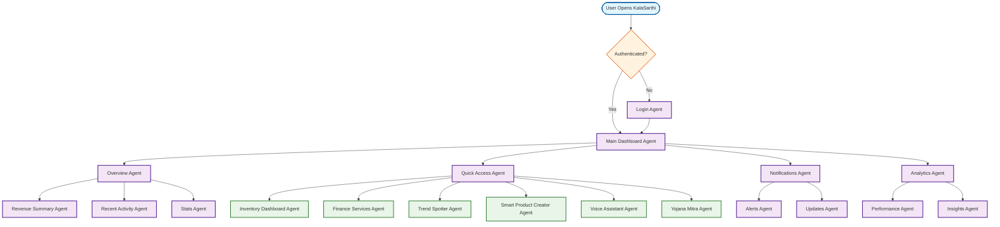

# Main Dashboard Workflow

## Overview
The primary interface and entry point for the KalaSarthi web application, providing an overview of all features and quick access to key functions.

## Workflow Diagram

## Key Agent Interconnections

### Main Dashboard Components
- **Main Dashboard Agent** → **Overview Agent**, **Quick Access Agent**, **Notifications Agent**, **Analytics Agent**

### Overview Section
- **Overview Agent** → **Revenue Summary Agent**, **Recent Activity Agent**, **Stats Agent**

### Quick Access to Features
- **Quick Access Agent** → **Inventory Dashboard Agent**, **Finance Services Agent**, **Trend Spotter Agent**, **Smart Product Creator Agent**, **Voice Assistant Agent**, **Yojana Mitra Agent**

### Notifications
- **Notifications Agent** → **Alerts Agent**, **Updates Agent**

### Analytics
- **Analytics Agent** → **Performance Agent**, **Insights Agent**

## Main Dashboard Features

### Overview Cards
- **Revenue Summary**: Today's sales, monthly revenue, growth trends
- **Recent Activity**: Latest orders, new products, customer interactions
- **Key Stats**: Total products, active orders, customer count

### Quick Access Tiles
- **Inventory Management**: Direct access to inventory dashboard
- **Finance Services**: Revenue, expenses, tax management
- **Trend Spotter**: Market trends and opportunities
- **Product Creator**: AI-powered product creation
- **Voice Assistant**: Hands-free navigation
- **Yojana Mitra**: Government schemes and benefits

### Notifications Panel
- **Alerts**: Important updates, low stock, payment reminders
- **Updates**: System updates, new features, announcements

### Analytics Widgets
- **Performance Metrics**: Sales performance, conversion rates
- **Insights**: AI-generated business insights and recommendations
