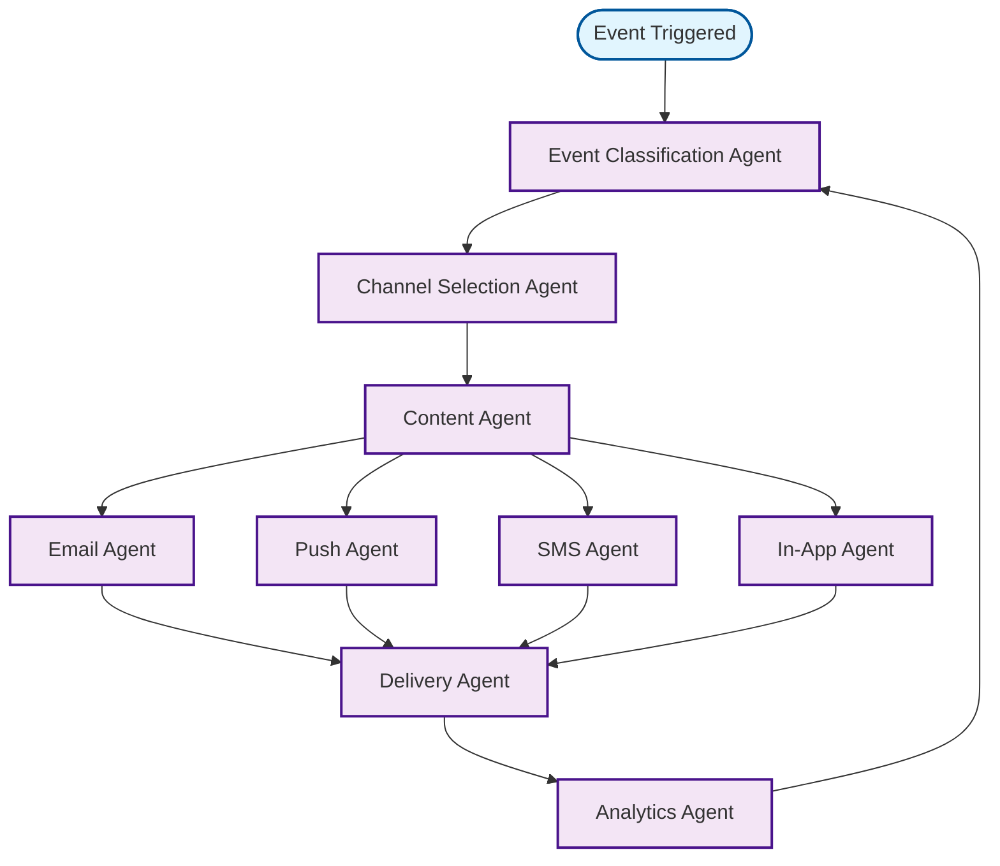

# Notifications Workflow

## Overview
Multi-channel notification system for user engagement and updates.

## Workflow Diagram

## Key Agent Interconnections

- **Event Classification Agent** → **Channel Selection Agent**
- **Channel Selection Agent** → **Content Agent**
- **Content Agent** → **Email Agent**, **Push Agent**, **SMS Agent**, **In-App Agent**
- **Email Agent** → **Delivery Agent**
- **Push Agent** → **Delivery Agent**
- **SMS Agent** → **Delivery Agent**
- **In-App Agent** → **Delivery Agent**
- **Delivery Agent** → **Analytics Agent**
- **Analytics Agent** → **Event Classification Agent**