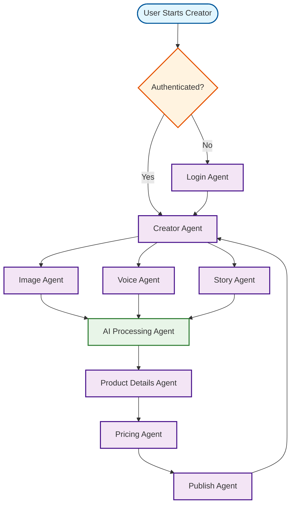

# Product Creator Workflow

## Overview
AI-powered product creation tool for artisans with voice guidance and automated content generation.

## Workflow Diagram

## Key Agent Interconnections

- **Creator Agent** → **Image Agent**, **Voice Agent**, **Story Agent**
- **Image Agent** → **AI Processing Agent**
- **Voice Agent** → **AI Processing Agent**
- **Story Agent** → **AI Processing Agent**
- **AI Processing Agent** → **Product Details Agent**
- **Product Details Agent** → **Pricing Agent**
- **Pricing Agent** → **Publish Agent**
- **Publish Agent** → **Creator Agent**