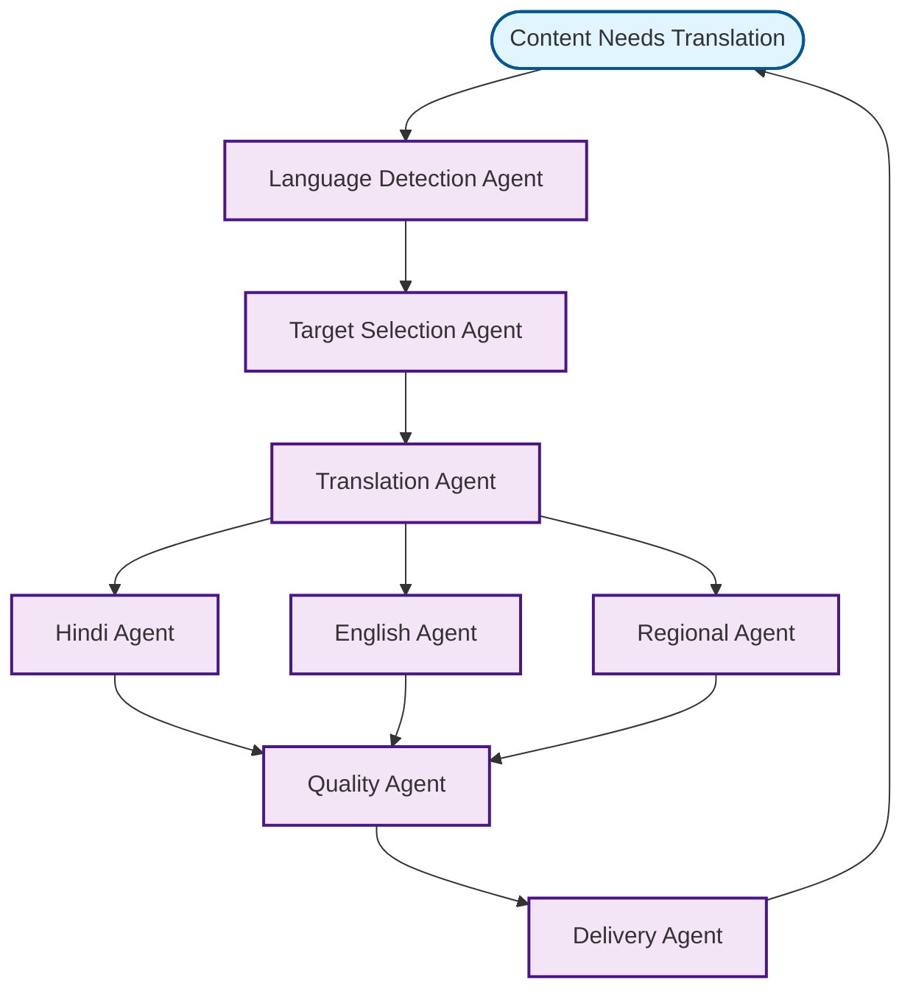

# Translation Services Workflow

## Overview
Multi-language translation services for content localization.

## Workflow Diagram

## Key Agent Interconnections

- **Language Detection Agent** → **Target Selection Agent**
- **Target Selection Agent** → **Translation Agent**
- **Translation Agent** → **Hindi Agent**, **English Agent**, **Regional Agent**
- **Hindi Agent** → **Quality Agent**
- **English Agent** → **Quality Agent**
- **Regional Agent** → **Quality Agent**
- **Quality Agent** → **Delivery Agent**
- **Delivery Agent** → **Language Detection Agent**