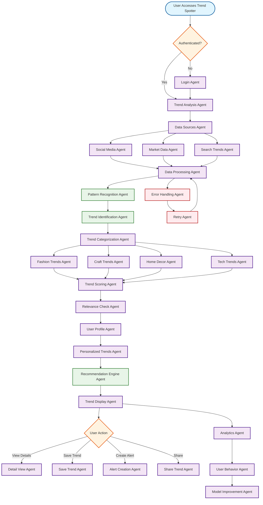

# Trend Spotter Workflow

## Overview
The Trend Spotter feature analyzes market trends, social media patterns, and consumer behavior to identify emerging opportunities for artisans and small businesses.

## Workflow Diagram

## Key Agent Interconnections

- **Data Sources Agent** → **Social Media Agent**, **Market Data Agent**, **Search Trends Agent**
- **Social Media Agent** → **Data Processing Agent**
- **Market Data Agent** → **Data Processing Agent**
- **Search Trends Agent** → **Data Processing Agent**
- **Data Processing Agent** → **Pattern Recognition Agent**
- **Pattern Recognition Agent** → **Trend Identification Agent**
- **Trend Identification Agent** → **Trend Categorization Agent**
- **Trend Categorization Agent** → **Fashion Trends Agent**, **Craft Trends Agent**, **Home Decor Agent**, **Tech Trends Agent**
- **Fashion Trends Agent** → **Trend Scoring Agent**
- **Craft Trends Agent** → **Trend Scoring Agent**
- **Home Decor Agent** → **Trend Scoring Agent**
- **Tech Trends Agent** → **Trend Scoring Agent**
- **Trend Scoring Agent** → **Relevance Check Agent**
- **Relevance Check Agent** → **User Profile Agent**
- **User Profile Agent** → **Personalized Trends Agent**
- **Personalized Trends Agent** → **Recommendation Engine Agent**
- **Recommendation Engine Agent** → **Trend Display Agent**
- **Trend Display Agent** → **Detail View Agent**, **Save Trend Agent**, **Alert Creation Agent**, **Share Trend Agent**
- **Trend Display Agent** → **Analytics Agent**
- **Analytics Agent** → **User Behavior Agent**
- **User Behavior Agent** → **Model Improvement Agent**