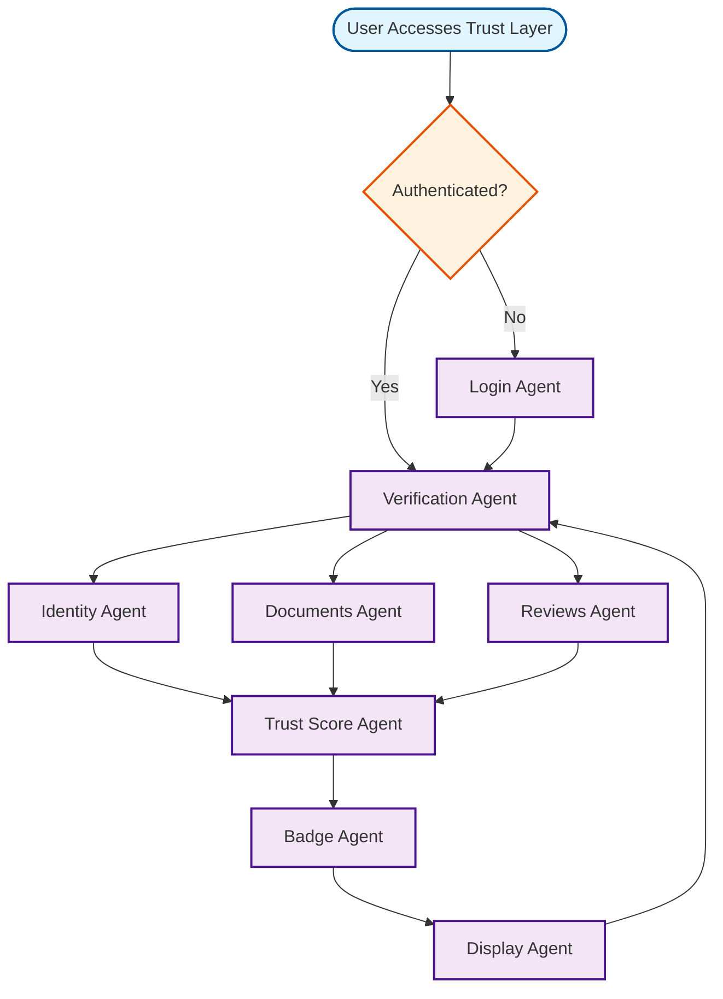

# Trust Layer Workflow

## Overview
Verification and trust-building system for artisans and buyers.

## Workflow Diagram

## Key Agent Interconnections

- **Verification Agent** → **Identity Agent**, **Documents Agent**, **Reviews Agent**
- **Identity Agent** → **Trust Score Agent**
- **Documents Agent** → **Trust Score Agent**
- **Reviews Agent** → **Trust Score Agent**
- **Trust Score Agent** → **Badge Agent**
- **Badge Agent** → **Display Agent**
- **Display Agent** → **Verification Agent**