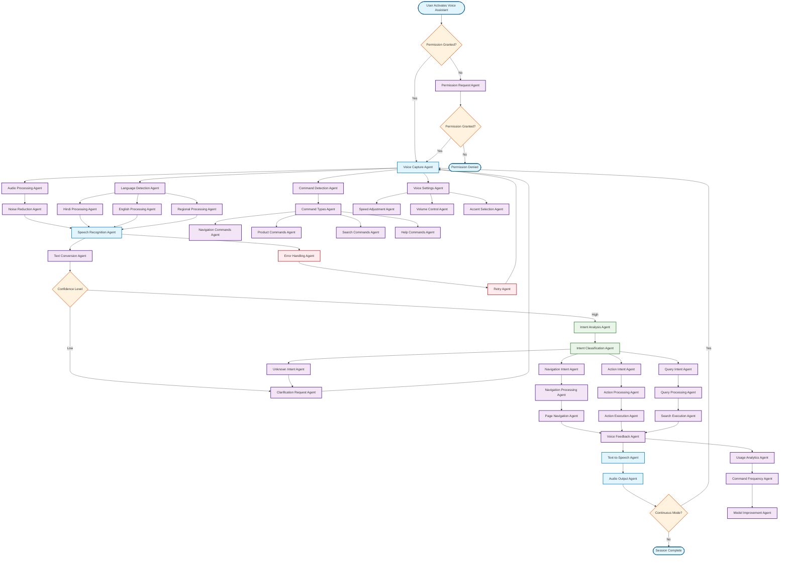

# Voice Assistant Workflow

## Overview
The Voice Assistant feature provides hands-free navigation and interaction with the KalaSarthi platform using natural language processing and speech recognition.

## Workflow Diagram

## Key Agent Interconnections

- **Voice Capture Agent** → **Audio Processing Agent**
- **Audio Processing Agent** → **Noise Reduction Agent**
- **Noise Reduction Agent** → **Speech Recognition Agent**
- **Speech Recognition Agent** → **Text Conversion Agent**
- **Text Conversion Agent** → **Intent Analysis Agent**
- **Intent Analysis Agent** → **Intent Classification Agent**
- **Intent Classification Agent** → **Navigation Intent Agent**, **Action Intent Agent**, **Query Intent Agent**, **Unknown Intent Agent**
- **Navigation Intent Agent** → **Navigation Processing Agent**
- **Action Intent Agent** → **Action Processing Agent**
- **Query Intent Agent** → **Query Processing Agent**
- **Navigation Processing Agent** → **Page Navigation Agent**
- **Action Processing Agent** → **Action Execution Agent**
- **Query Processing Agent** → **Search Execution Agent**
- **Page Navigation Agent** → **Voice Feedback Agent**
- **Action Execution Agent** → **Voice Feedback Agent**
- **Search Execution Agent** → **Voice Feedback Agent**
- **Voice Feedback Agent** → **Text-to-Speech Agent**
- **Text-to-Speech Agent** → **Audio Output Agent**
- **Voice Capture Agent** → **Language Detection Agent**
- **Language Detection Agent** → **Hindi Processing Agent**, **English Processing Agent**, **Regional Processing Agent**
- **Hindi Processing Agent** → **Speech Recognition Agent**
- **English Processing Agent** → **Speech Recognition Agent**
- **Regional Processing Agent** → **Speech Recognition Agent**
- **Voice Capture Agent** → **Command Detection Agent**
- **Command Detection Agent** → **Command Types Agent**
- **Command Types Agent** → **Navigation Commands Agent**, **Product Commands Agent**, **Search Commands Agent**, **Help Commands Agent**
- **Voice Capture Agent** → **Voice Settings Agent**
- **Voice Settings Agent** → **Speed Adjustment Agent**, **Volume Control Agent**, **Accent Selection Agent**
- **Voice Feedback Agent** → **Usage Analytics Agent**
- **Usage Analytics Agent** → **Command Frequency Agent**
- **Command Frequency Agent** → **Model Improvement Agent**