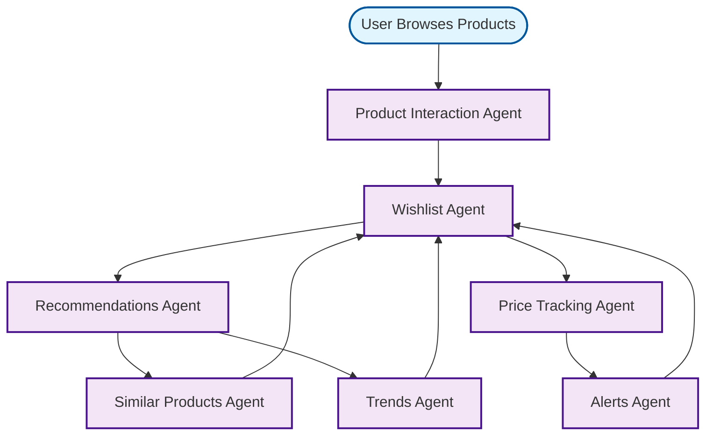

# Wishlist Workflow

## Overview
Product wishlist management with recommendations and price tracking.

## Workflow Diagram

## Key Agent Interconnections

- **Product Interaction Agent** → **Wishlist Agent**
- **Wishlist Agent** → **Recommendations Agent**
- **Recommendations Agent** → **Similar Products Agent**, **Trends Agent**
- **Similar Products Agent** → **Wishlist Agent**
- **Trends Agent** → **Wishlist Agent**
- **Wishlist Agent** → **Price Tracking Agent**
- **Price Tracking Agent** → **Alerts Agent**
- **Alerts Agent** → **Wishlist Agent**