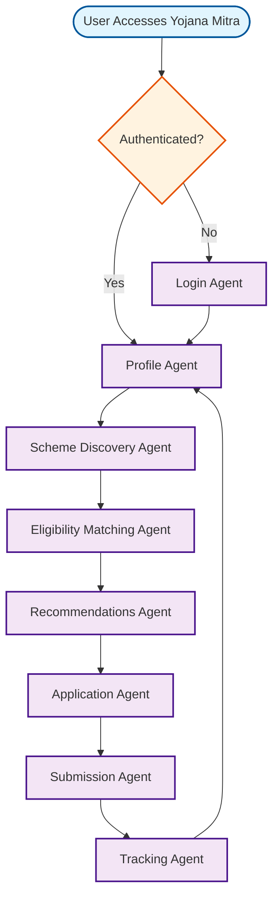

# Yojana Mitra Workflow

## Overview
Government scheme discovery and application assistance for artisans and small businesses.

## Workflow Diagram

## Key Agent Interconnections

- **Profile Agent** → **Scheme Discovery Agent**
- **Scheme Discovery Agent** → **Eligibility Matching Agent**
- **Eligibility Matching Agent** → **Recommendations Agent**
- **Recommendations Agent** → **Application Agent**
- **Application Agent** → **Submission Agent**
- **Submission Agent** → **Tracking Agent**
- **Tracking Agent** → **Profile Agent**